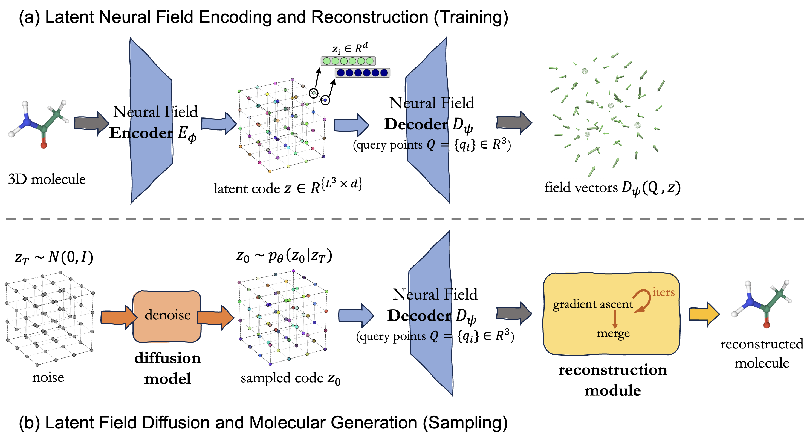

# VecMol: Vector-Field Representations for 3D Molecule Generation

This repository contains an implementation of [VecMol](), a model for unconditional 3D molecule generation using neural fields:

## 1. Setup



## Workflow
We assume the user have anaconda (or, preferably mamba) installed.
Multi GPU support is managed with Pytorch Lightning.
Configs are managed with Hydra and logging is managed by Tensorboard.

### 1. Install the environment
Install the vecmol env and package:
```bash
mamba env create -f env.yml
conda activate vecmol_oss
pip install -e .
```

Run all commands below from **vecmol/** (or use `python vecmol/script.py` from project root). PyG extensions: `pip install torch-cluster torch-scatter -f https://data.pyg.org/whl/torch-2.5.0+cu124.html` (adjust for your PyTorch/CUDA).

## 2. Prepare Data

From `vecmol/dataset`:

| Dataset      | Script                     | Notes |
|-------------|----------------------------|-------|
| QM9         | `python create_data_qm9.py` | — |
| GEOM-drugs  | `python create_data_geomdrugs.py` | Slow; splits follow [MiDi](https://github.com/cvignac/MiDi). |

Optional LMDB: `convert_to_lmdb.py`, `convert_codes_to_lmdb.py`, `split_lmdb.py` (see scripts).

## 3. Training

**Neural field (NF)** — decoder = conditional neural field, encoder = 3D GNN. Outputs go to `exps/neural_field/`.

```bash
cd vecmol
python train_nf.py --config-name train_nf_qm9    # or train_nf_drugs
```

**VecMol denoiser** — after NF is trained, set `nf_pretrained_path`:

```bash
python train_diffusion.py --config-name train_diffusion_drugs nf_pretrained_path=$NF_PRETRAINED_PATH dset.batch_size=1024
```

**Precomputed codes** (saves compute, uses disk): Data augmentation is done by encoding each molecule under multiple random rotations. Run `infer_codes.py` per split with `num_augmentations=30` to save 30 augmented codes per molecule; then train the denoiser with `on_the_fly=False` so it reads these codes instead of encoding on the fly.

## 4. Sampling

To sample 1000 molecules with the above vecmol model, set `diffusion_pretrained_path` and run:
```bash
python sample_diffusion.py --config-name sample_diffusion_drugs diffusion_pretrained_path=$DIFFUSION_PRETRAINED_PATH max_samples=1000
```


## Configs

- `configs/dset/` — dataset (qm9, drugs); `configs/` — `train_nf_*`, `train_diffusion_*`, `infer_codes`, `sample_diffusion`.

## License

Genentech Non-Commercial License (see **LICENSE.txt**).